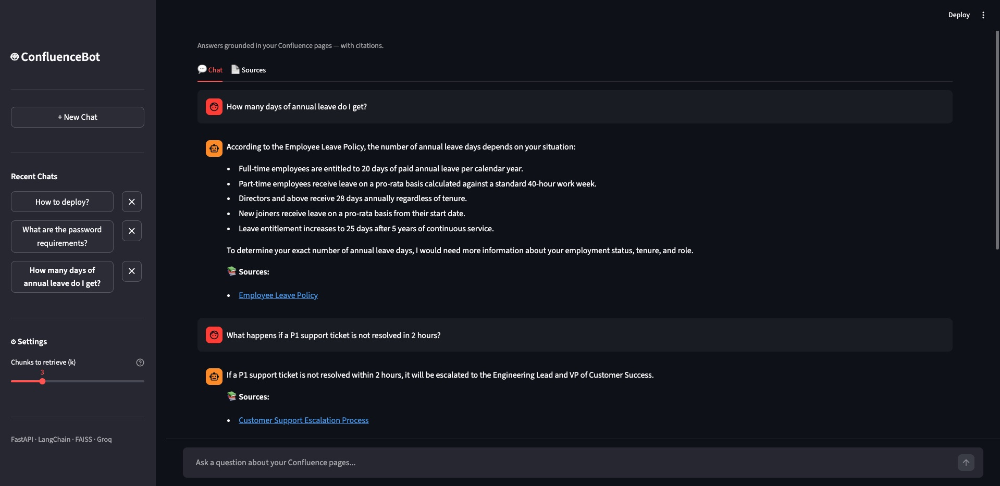
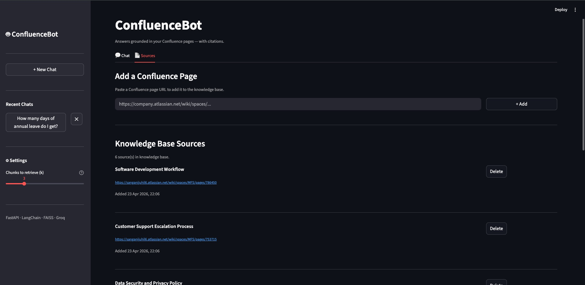

# 🤖 ConfluenceBot

> A production-grade RAG (Retrieval-Augmented Generation) chatbot that answers questions 
> from Confluence pages with cited, grounded answers — zero hallucination.



---

## 📌 Overview

ConfluenceBot connects to your Confluence workspace, ingests page content, and lets you 
ask natural language questions. Every answer is grounded strictly in your Confluence data 
and comes with clickable citations so you can verify the source instantly.

Built as a learning project to deeply understand RAG pipelines, vector search, LLM 
integration, and production API design — from scratch, milestone by milestone.

---

## ✨ Features

- 🔍 **Semantic Search** — Finds relevant content by meaning, not just keywords
- 📚 **Cited Answers** — Every response includes clickable links to source Confluence pages
- 🚫 **Anti-Hallucination** — LLM is strictly instructed to answer only from retrieved context
- 💬 **Persistent Chat History** — Conversations saved to SQLite, survive browser refresh
- 📄 **Source Management** — Add or remove Confluence URLs from the knowledge base via UI
- ⚡ **Fast Inference** — Groq cloud API for LLM, local Ollama for embeddings
- 🔄 **Real Confluence Integration** — Live ingestion from Confluence Cloud REST API
- 🎛️ **Tunable Retrieval** — Adjust chunk count (k) per query from the UI

---

## 🏗️ Architecture

User Question (Streamlit UI)
→ FastAPI REST API
→ Embed query (Ollama nomic-embed-text, local)
→ Similarity search (FAISS vector store)
→ Retrieve top-k chunks with metadata
→ Build grounded prompt (anti-hallucination system prompt)
→ Generate answer (Groq llama-3.1-8b-instant, cloud)
→ Extract citations from chunk metadata
→ Return answer + citations to UI

---

## 🛠️ Tech Stack

| Layer | Technology | Why |
|---|---|---|
| Language | Python 3.11+ | Modern async support |
| API Framework | FastAPI | Async, auto-docs, Pydantic validation |
| UI | Streamlit | Pure Python chat interface |
| LLM | Groq (llama-3.1-8b-instant) | Free tier, 560 tok/sec, no RAM pressure |
| Embeddings | Ollama (nomic-embed-text) | Local, free, 768-dim vectors |
| Vector Store | FAISS | Fast similarity search, runs in memory |
| AI Framework | LangChain | Document loaders, text splitters, chains |
| Database | SQLite | Zero-config persistent chat history |
| Data Source | Confluence Cloud REST API | Live page ingestion |
| Package Manager | uv | 10-100x faster than pip |

---

## 📸 Screenshots

### Chat with Citations


### Source Management


---

## 🚀 Getting Started

### Prerequisites

- Python 3.11+
- [uv](https://github.com/astral-sh/uv) package manager
- [Ollama](https://ollama.com) installed locally
- [Groq](https://console.groq.com) free API key
- Confluence Cloud account

### 1. Clone the Repository

```bash
git clone https://github.com/YOUR_USERNAME/Confluence_bot.git
cd Confluence_bot
```

### 2. Create Virtual Environment

```bash
uv venv
source .venv/bin/activate  # Mac/Linux
```

### 3. Install Dependencies

```bash
uv sync
```

### 4. Pull Embedding Model

```bash
ollama pull nomic-embed-text
```

### 5. Configure Environment

Create a `.env` file at the project root:

```env
APP_NAME=ConfluenceBot
APP_VERSION=0.1.0

# Embeddings — local Ollama
EMBEDDING_MODEL=nomic-embed-text
OLLAMA_BASE_URL=http://localhost:11434

# LLM — Groq cloud (free tier)
GROQ_API_KEY=your_groq_api_key_here
LLM_MODEL=llama-3.1-8b-instant

# Confluence
CONFLUENCE_URL=https://yoursite.atlassian.net
CONFLUENCE_EMAIL=your@email.com
CONFLUENCE_API_TOKEN=your_confluence_api_token
CONFLUENCE_SPACE_KEY=your_space_key
```

### 6. Start the Backend

```bash
uvicorn app.main:app --reload
```

### 7. Ingest Confluence Pages

Visit `http://localhost:8000/docs` and trigger `GET /api/ingest`

### 8. Start the UI

In a second terminal:

```bash
streamlit run ui.py
```

Visit `http://localhost:8501`

---

## 📁 Project Structure  

confluencebot/  
├── app/  
│   ├── api/  
│   │   └── routes.py          # FastAPI endpoints  
│   ├── chains/  
│   │   └── rag_chain.py       # RAG pipeline orchestration  
│   ├── core/  
│   │   ├── config.py          # Centralized settings via Pydantic  
│   │   └── database.py        # SQLite chat and source persistence  
│   ├── ingestion/  
│   │   ├── loader.py          # Mock JSON loader (testing)  
│   │   ├── confluence_loader.py  # Real Confluence API loader  
│   │   ├── confluence_fetcher.py # URL-based page fetcher  
│   │   └── chunker.py         # RecursiveCharacterTextSplitter  
│   ├── retriever/  
│   │   ├── embeddings.py      # Ollama nomic-embed-text  
│   │   └── vector_store.py    # FAISS build, save, load, search  
│   └── main.py                # FastAPI app entry point  
├── data/  
│   └── confluence_pages.json  # Mock Confluence pages  
├── assets/  
│   ├── Screenshot_chat.jpeg  
│   └── Screenshot_sources.jpeg  
├── ui.py                      # Streamlit frontend  
├── .env                       # Never committed  
├── pyproject.toml             # uv dependency management  
└── README.md  

---

## 🧠 RAG Pipeline Deep Dive

### Why RAG?

Large Language Models hallucinate. They confidently generate plausible-sounding but 
incorrect information when they don't know the answer. RAG solves this by giving the LLM 
a specific, retrieved context to answer from — and strictly instructing it not to go beyond 
that context.

### How Retrieval Works

1. Each Confluence page is split into ~500 character chunks with 100 character overlap
2. Each chunk is embedded into a 768-dimensional vector using nomic-embed-text
3. Vectors are stored in a FAISS index saved to disk
4. At query time, the question is embedded and FAISS finds the k nearest chunk vectors
5. Those chunks are sent to the LLM as context — nothing else

### Anti-Hallucination Strategy

The system prompt explicitly instructs the LLM:
- Answer ONLY from the provided context
- If context is insufficient, say so — never guess
- Never fabricate URLs, names, or facts

Citations are extracted from chunk **metadata** — not generated by the LLM. This 
guarantees every citation is real and verifiable.

---

## 🔮 Upcoming

- ChromaDB as alternative vector store with metadata filtering
- Docker and Kubernetes deployment
- Webhook-triggered re-ingestion when Confluence pages update
- Multi-space support
- LangGraph for multi-step agentic question answering

---

## 👤 Author

Built by **[Juhil Sangani]** as a hands-on learning project to master RAG-based AI systems.

---

## 📄 License

MIT License — feel free to use this as a reference for your own RAG projects.
